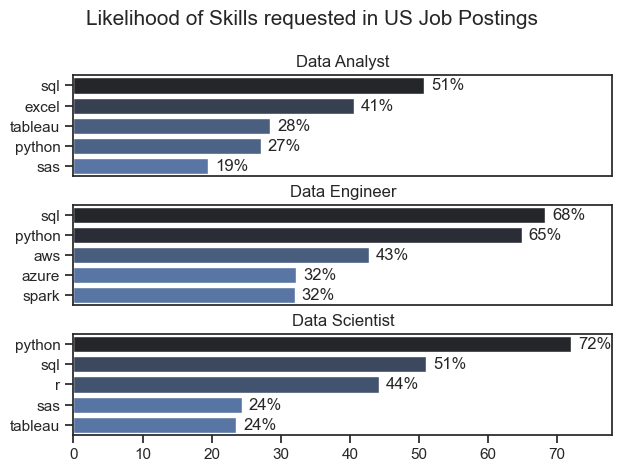

# The Analysis

## 1. What are the most demanded skills for the top 3 most popular data roles?

To find the most demanded skills for the top 3 most popular data roles. I filtered out those positions by which ones were the most popular, and got the top 5 skills for these top 3 roles. This query highlights the most popular job titles and their top skills, showing which skills I should pay attention to depending on the role I'm targeting.

View my notebook with detailed steps here: [2_Skill_Demand.ipynb](3_Project/2_Skill_Demand.ipynb)

### Visualize Data

```python
fig, ax = plt.subplots(len(job_titles), 1)

for i, job_title in enumerate(job_titles):
    df_plot = df_skills_perc[df_skills_perc['job_title_short'] == job_title].head(5)[::-1]
    sns.barplot(data=df_plot, x='skill_percent', y='job_skills', ax=ax[i], hue='skill_count', palette='dark:b_r')
    
plt.show()
```

### Results



### Insights

- Python: Highly requested across all roles, with 72% for Data Scientist, 65% for Data Engineer, and 27% for Data Analyst. It's crucial for programming, data manipulation, and machine learning.

- SQL: Essential for all roles, with the highest demand for Data Engineer (68%), Data Scientist (51%), and Data Analyst (51%). Key for data querying and relational database management.

- Python and SQL are fundamental skills across all data roles.

- Data Analysts focus more on tools for data manipulation and visualization (Excel, Tableau).

- Data Engineers require cloud platform knowledge (AWS, Azure) and big data tools (Spark).

- Data Scientists need expertise in statistical analysis (R, SAS) and visualization tools (Tableau).
